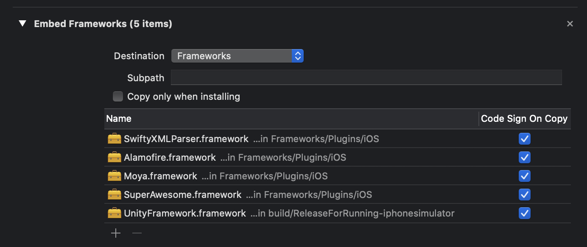

SuperAwesome Unity SDK
==========================

     

For more information check out the [SuperAwesome Developer Portal](https://superawesomeltd.github.io/sa-unity-sdk/).

New version
===========
Run `./build.sh -v x.y.z` to generate a new `.unitypackage` in `scripts/output/`.

Setup
=====
Add this environment variable to your shell profile, replacing the path with the location of your Android SDK:
`export ANDROID_SDK_ROOT="path/to/Android/sdk"`

Setup iOS
=========
To finish the setup once you build the Unity project as an iOS application, you also need to add the following frameworks into:
`Build Phases` -> `Embed Framework`.

Setup Android
=============
To finish the setup once you build the Unity project as an Android applicatiom, you will need to add `Kotlin` support as part of your `gradle` setup, if you haven't already added it.

Add this repository to the list of repositoies

`maven { url "https://plugins.gradle.org/m2/" }`

Then add this classpath

`classpath "org.jetbrains.kotlin:kotlin-gradle-plugin:$kotlinVersion"`

The finally add the `kotlin plugins`

