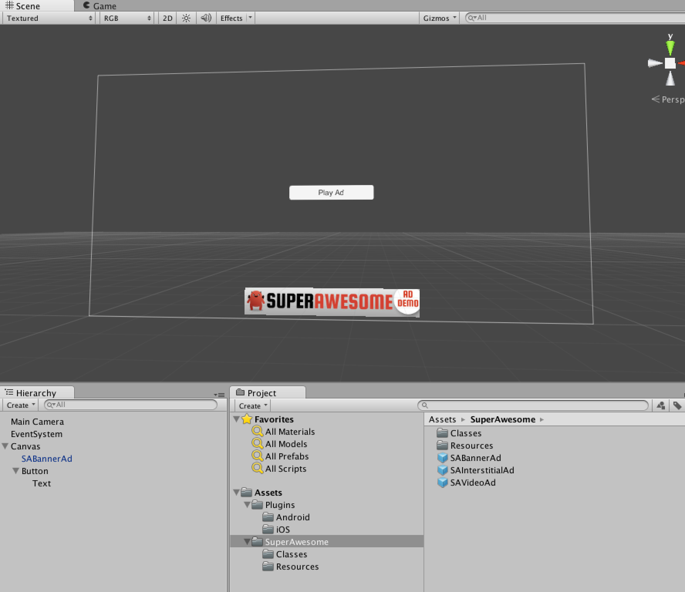
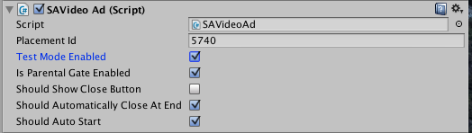

Once you've succesfully integrated the Unity SDK (and the native iOS or Android ones), the simplest way to actually load and diplay ads in your app is through prefabs.

In the Project Explorer panel in the Unity interface, find the `Assets` folder and the `SuperAwesome` subfolder.
There you'll find three prefabs called:

* SABannerAd
* SAInterstitialAd 
* SAVideoAd

Drag and drop any of then into your scene on the UI Layer.

You'll see the prefab has a default rectangular shape and has a default texture associated. Don't worry about this, it will only display in editing mode, not playing mode.

Each prefab has a number of associated parameters, that show up when you select a prefab.
In summary, this is what they're named and what they influence:

| Parameter | Description | Banner | Interstitial | Video |
|-------------------------|
| Placement Id | Specify the ID of the placement you want to load an ad for |  |  |  | 
| Test Mode Enabled | If this placement is in test mode or not |  |  |  |
| Is Parental Gate Enabled | If when clicking on the ad, a user will activate a Parental Gate |  |  |  |
| Should Auto Start | Always set to True for Prefabs |  |  |  |
| Position | Only for banners; Can be Top or Bottom |  |  |  |
| Size | Only for banners; Can be 320x50, 300x50, 728x90, 300x250 |  |  |  |
| Should Automatically Close At End | Only for video; specifies if the ad should close when it ends; should be set to true for prefabs |  |  |  |
| Should Show Close Button | Only for video; specifies if the close button should be visible |  |  |  |

Banners:

Interstitials:

Video Ads:

