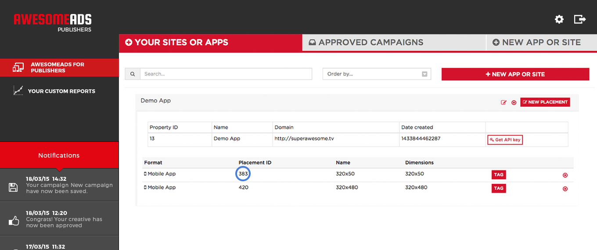

If you haven't registered your app on the SuperAwesome Dashboard yet, you can do that by going to [http://beta.dashboard.superawesome.tv](http://beta.dashboard.superawesome.tv) and creating a new app.

Add your app on the dashboard and create the placements with the format that you want to use in your app. To get SuperAwesome ads working in your app you will only have to note down your placement ID from our dashboard.

To integrate the SDK into you app, first download it from Github: https://github.com/SuperAwesomeLTD/sa-unity-sdk/tree/develop_awesomeads

Drag and drop the SuperAwesome.unitypackage file into your Unity project.