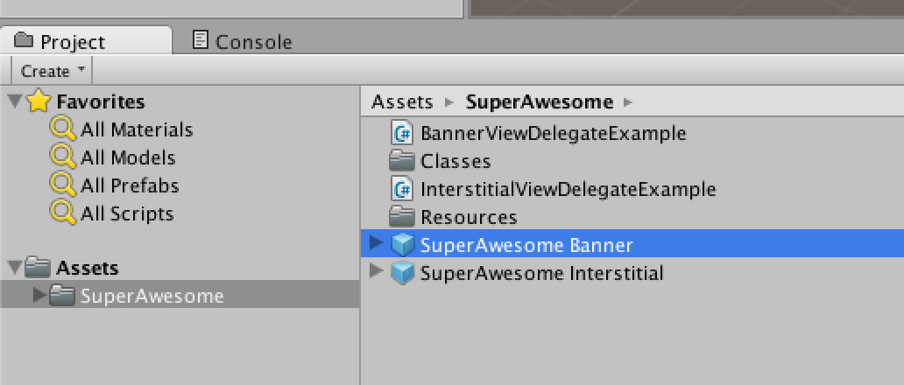
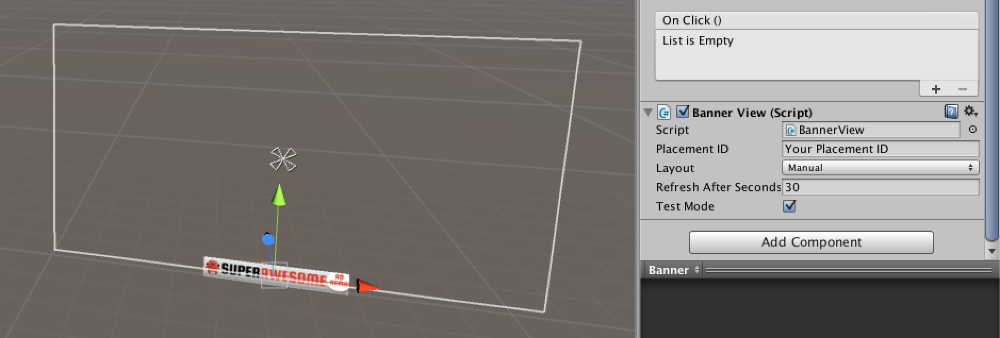
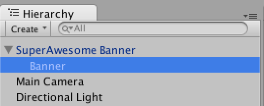

After importing the SuperAwesome Unity package, navigate to the Assets/SuperAwesome directory in the Project tab, locate the 'SuperAwesome Banner' prefab:

Drag the prefab into your scene; you should see a canvas containing the banner ad. Select the banner ad in order to modify its options in the Inspector tab.

Note: Make sure you select the Banner object, not the 'SuperAwesome Banner' parent, as seen in the hierarchy tab:

In the inspector tab you can change the options for your banner ad. Possible options include:

| Option                | Description                                                                                                                                                                          |
|-----------------------|--------------------------------------------------------------------------------------------------------------------------------------------------------------------------------------|
| Placement ID          | This is your placement ID, as found on the SuperAwesome Dashboard.                                                                                                                   |
| Layout                | Can be selected from Manual, Top or Bottom. If Manual is selected, the ad will be show wherever you choose to place it. Otherwise it will appear at the top or bottom of the screen. |
| Refresh After Seconds | The banner will reload with a new ad every 30 seconds by default. You can change the rate using this option.                                                                         |
| Test Mode             | If selected, the banner will only load test ads from the server. Use this option while developing, and turn it off when your app is ready for production.                            |