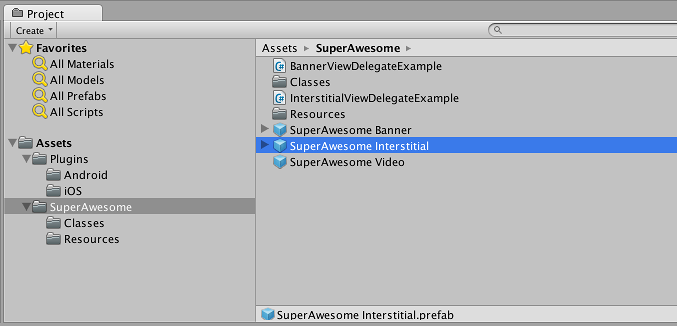
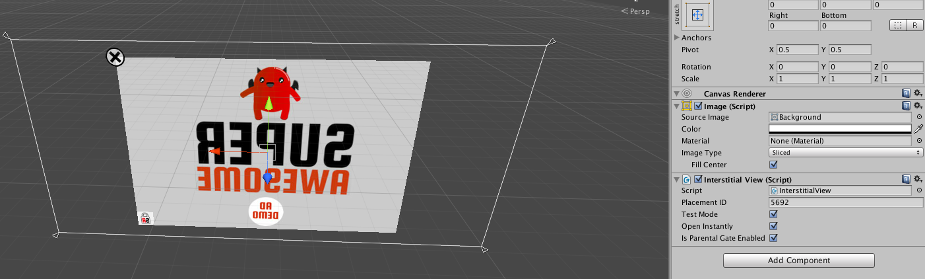
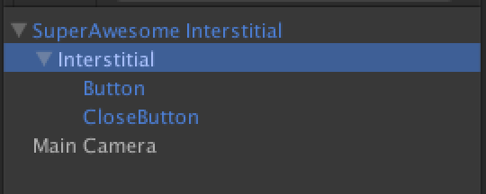

After importing the SuperAwesome Unity package, navigate to the Assets/SuperAwesome directory in the Project tab, locate the 'SuperAwesome Interstitial' prefab:

Drag the prefab into your scene; you should see a canvas containing the interstitial ad. Select the interstitial ad in order to modify its options in the Inspector tab.

Note: Make sure you select the Interstitial object, not the 'SuperAwesome Interstitial' parent, as seen in the hierarchy tab:

In the inspector tab you can change the options for your interstitial ad. Possible options include:

| Option                | Description                                                                                                                                                                          |
|-----------------------|--------------------------------------------------------------------------------------------------------------------------------------------------------------------------------------|
| Placement ID          | This is your placement ID, as found on the SuperAwesome Dashboard.                                                                                                                   |
| Test Mode             | If selected, the interstitial will only load test ads from the server. Use this option while developing, and turn it off when your app is ready for production.                            |