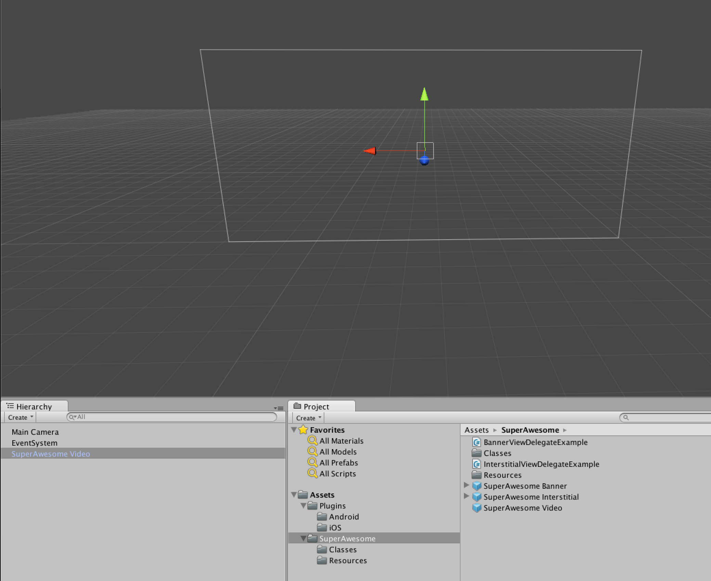

Once you exported your Unity project to either iOS or Android, and added the AwesomeAds SDK, adding a video ad is easy.

Again, navigate to the Assets/SuperAwesome directory in the Project tab and locate the 'SuperAwesome Video' prefab.

Drag the prefab into your scene; you should see a canvas containing the video ad. 

Select the video ad in order to modify its options in the Inspector tab.

In the inspector tab you can change the options for your video ad. Possible options include:

| Option                | Description                                                                                                                                                                          |
|-----------------------|--------------------------------------------------------------------------------------------------------------------------------------------------------------------------------------|
| Placement ID          | This is your placement ID, as found on the SuperAwesome Dashboard.                                                                                                                   |
| Test Mode             | If selected, the video will only load test ads from the server. Use this option while developing, and turn it off when your app is ready for production.                      |
| Should Autostart		| If selected, the video will load and show instantly. If not, you will have to manually play it using the open() function |
| is Parental Gate Enabled | When set to true, a parental gate will appear when users press on an ad. If users can solve a basic math question, they will be allowed to pass through. Else they will remain in the application | 

