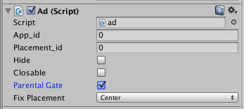
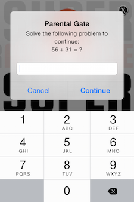

Parental gates can be used within the Unity SDK, but currently only for apps that are deployed to iOS. The parental gate will not work for other apps, and all links will simply exit the application as usual.
A parental gate presents an adult level task which must be completed in order to continue, thus preventing kids from engaging in commerce or following links out of an app to websites, social networks, or other apps without the knowledge of their parent or guardian.

In order to implement the parental gate you must first follow the same instructions under the **iOS** section here in order for the native SDK to work with your app: https://developers.superawesome.tv/docs/unitysdk/Video%20Ads/Configuration

Once this is done, you can simply toggle the parental gate for each ad using the check box for the ad.cs script on your object:

If this checkbox is toggled in an iOS app the user will be presented with the parental gate before leaving your application by clicking on an ad, and the browser will not open if the problem is not solved correctly.

